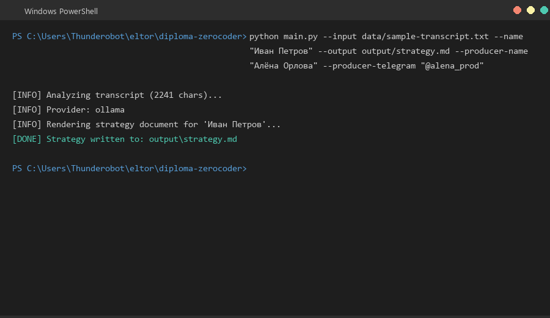
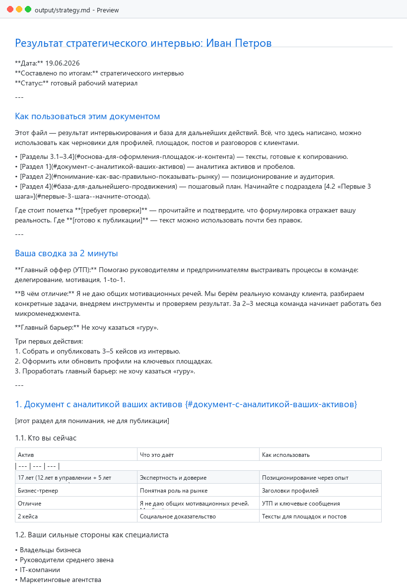

# interview-to-strategy

Универсальный CLI-инструмент для продюсеров, маркетологов и специалистов: превращает сырую текстовую расшифровку стратегического интервью в структурированный Markdown-документ с позиционированием, услугами, кейсами и планом продвижения.

Подходит для любой ниши: психологи, коучи, тренеры, юристы, дизайнеры, разработчики, фотографы, наставники — кто угодно.

## Что делает

1. Читает `.txt` файл с расшифровкой интервью.
2. Извлекает ключевые блоки: кто специалист, что продаёт, кому, за сколько, какие кейсы, какие каналы, какие барьеры.
3. Генерирует готовый `.md` файл по шаблону финального документа для клиента.

## Как установить и запустить с нуля

> Эта инструкция для Windows. Если у вас Mac или Linux — шаги почти такие же, но переменные окружения задаются иначе.

### 1. Скачать проект с GitHub

Откройте браузер, перейдите по ссылке:

```
https://github.com/sskosmos88/interview-to-strategy
```

Нажмите зелёную кнопку **Code → Download ZIP**. Распакуйте архив в любую папку, например `C:\Users\ВашеИмя\interview-to-strategy`.

Или, если у вас установлен Git, выполните в PowerShell:

```powershell
git clone https://github.com/sskosmos88/interview-to-strategy.git
cd interview-to-strategy
```

### 2. Установить Python

Программа написана на языке Python. Скачайте его здесь: https://www.python.org/downloads/

При установке **обязательно поставьте галочку** «Add Python to PATH».

Чтобы проверить, что Python установился, откройте PowerShell и введите:

```powershell
python --version
```

Если увидели что-то вроде `Python 3.13.0` — всё ок.

### 3. Установить зависимости

Зависимости — это готовые библиотеки, которые использует программа. Они перечислены в файле `requirements.txt`.

Откройте PowerShell **внутри папки проекта** и выполните:

```powershell
pip install -r requirements.txt
```

Команда `pip` устанавливает всё автоматически. Это стандартный способ в Python — не нужно ничего скачивать вручную.

### 4. Подготовить расшифровку интервью

У вас должен быть `.txt` файл с текстом интервью. Положите его, например, в папку `data/`:

```
interview-to-strategy/
  data/
    my-interview.txt
```

> Инструмент не умеет расшифровывать MP3. Аудио нужно перевести в текст заранее через Whisper, Яндекс SpeechKit, Sonix и т.п.

### 5. Запустить генерацию

Самый простой вариант — локальная модель Ollama (бесплатно, без API-ключей):

```powershell
# 1. Скачайте и установите Ollama: https://ollama.com/
# 2. Скачайте модель:
ollama pull llama3

# 3. Запустите генератор:
$env:OLLAMA_URL = "http://localhost:11434"
$env:OLLAMA_MODEL = "llama3:latest"
python main.py --input data/my-interview.txt --name "Иван Петров" --output output/strategy.md
```

Готовый файл появится в `output/strategy.md`.

Если Ollama не хочется настраивать, можно запустить без LLM:

```powershell
python main.py --input data/my-interview.txt --name "Иван Петров" --output output/strategy.md --fallback
```

Результат будет проще, но работает без интернета и API-ключей.

## LLM-провайдеры

Инструмент может работать с несколькими источниками анализа:

| Провайдер | Требуется | Плюсы |
| --- | --- | --- |
| **Ollama** | Установленная модель | Бесплатно, локально, приватно |
| **Anthropic Claude** | `ANTHROPIC_API_KEY` | Высокое качество извлечения |
| **Perplexity** | `PERPLEXITY_API_KEY` | OpenAI-совместимый API |
| **Rule-based fallback** | Ничего | Работает без интернета, но результат слабее |

### Настройка провайдеров

Скопируйте `.env.example` в `.env` и заполните нужный раздел:

```bash
cp .env.example .env
```

#### Ollama

```env
OLLAMA_URL=http://localhost:11434
OLLAMA_MODEL=llama3:latest
```

[Установить Ollama](https://ollama.com/) и скачать модель:

```bash
ollama pull llama3
```

#### Anthropic Claude

```env
ANTHROPIC_API_KEY=sk-ant-api03-your-key-here
```

#### Perplexity

```env
PERPLEXITY_API_KEY=pplx-your-key-here
PERPLEXITY_MODEL=llama-3-sonar-large-32k-online
```

## Аргументы CLI

| Аргумент | Описание |
| --- | --- |
| `--input`, `-i` | Путь к файлу с расшифровкой интервью |
| `--name`, `-n` | Имя специалиста (fallback, если не определилось автоматически) |
| `--output`, `-o` | Путь для сохранения итогового `.md` |
| `--fallback` | Использовать локальный rule-based анализ без LLM |
| `--producer-name` | Имя продюсера / автора документа |
| `--producer-phone` | Телефон продюсера |
| `--producer-telegram` | Telegram продюсера |
| `--producer-site` | Сайт продюсера |
| `--producer-vk` | VK продюсера |
| `--producer-email` | Email продюсера |

## Пример

```bash
python main.py \
  --input data/ivanova-interview.txt \
  --name "Мария Иванова" \
  --output output/ivanova-strategy.md \
  --producer-name "Алёна Орлова" \
  --producer-telegram "@alena_prod"
```

## Структура выходного документа

- Сводка за 2 минуты
- Аналитика активов и пробелов
- Позиционирование и аудитория
- Готовые тексты для площадок и контента
- План первых шагов и метрики
- Подпись продюсера

## Структура проекта

```
interview-to-strategy/
├── .claude/skills/          # Claude skill с описанием инструмента
├── data/                    # Примеры входных транскрипций
├── src/
│   ├── analyzer.py          # Извлечение данных из текста (multi-provider)
│   └── formatter.py         # Генерация Markdown-документа
├── main.py                  # CLI-точка входа
├── requirements.txt
├── .env.example
└── README.md
```

## Скриншоты

### Терминал: запуск с Ollama


### Результат: стратегический документ



## Требования

- Python 3.10+
- Один из провайдеров или флаг `--fallback`
- Для Ollama: запущенный `ollama serve` и скачанная модель

## Лицензия

MIT — используйте свободно для своих проектов.
